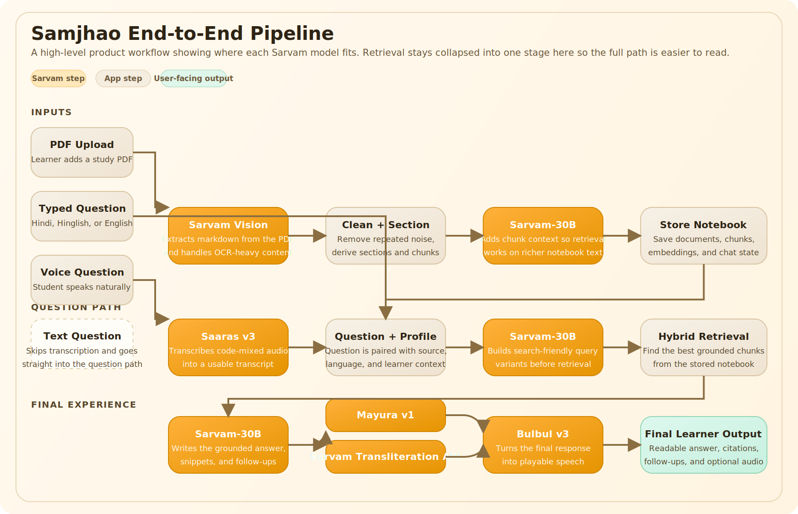
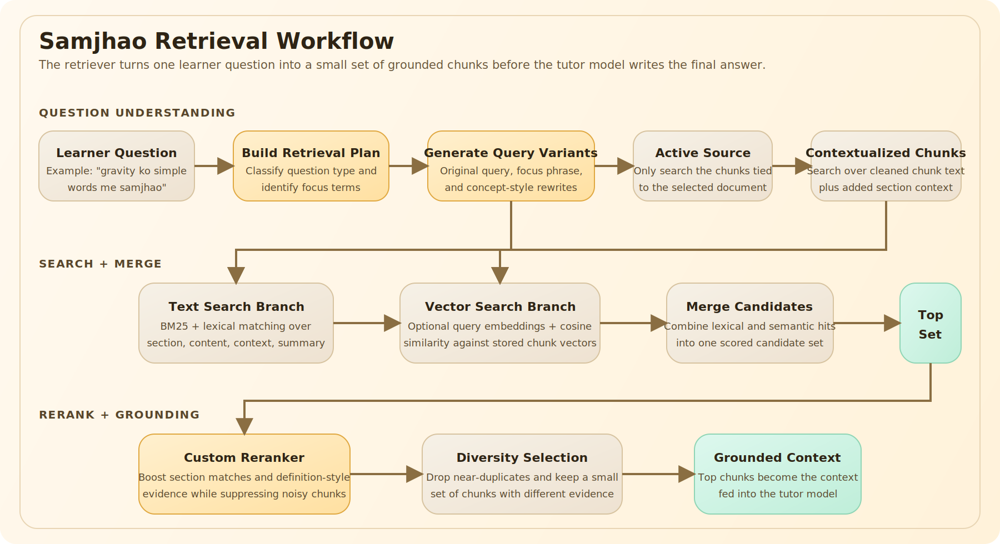

<div align="center">
  

  <h1>Samjhao</h1>

  <p><strong>An India-first, source-grounded study notebook for Hindi, Hinglish, and English learners.</strong></p>

  <p>
    Ask from your own PDFs, retrieve the most relevant evidence, and get answers that stay tied to the material instead of drifting into generic chat.
  </p>

  <p>
    
    
    
    
    
    
  </p>

  <p>
    <a href="#quick-start">Quick Start</a>
    ·
    <a href="#why-samjhao">Why Samjhao</a>
    ·
    <a href="#how-it-works">How It Works</a>
    ·
    <a href="#retrieval-system">Retrieval System</a>
    ·
    <a href="#project-structure">Project Structure</a>
  </p>
</div>

---


## Samjhao Empowers You To

- Ask from your own sources and stay grounded instead of drifting into generic chat
- Study in Hindi, Hinglish, or English without forcing the source and question into one language
- Turn scanned or OCR-heavy PDFs into a usable notebook workspace
- Search intelligently across your notes with hybrid retrieval
- Chat with context powered by retrieved source evidence
- Use voice input and audio playback for a more natural learning loop

## Why Samjhao

Most study assistants assume clean English input, clean digital documents, and a user who asks questions in the same language as the source.

That is not how learning usually works for many Indian students.

Samjhao is built for a more realistic flow:

- the source might be a scanned or OCR-heavy PDF
- the learner may ask in Hindi, Hinglish, or English
- the answer still needs to stay faithful to the original material
- the experience should feel like a study workspace, not a generic chatbot

## What Makes It Different

| Capability | Samjhao | Generic AI chat |
| --- | --- | --- |
| Answers grounded in uploaded PDFs | Yes | Often inconsistent |
| Hindi / Hinglish answer modes | First-class | Usually secondary |
| OCR-aware document ingestion | Yes | Usually external |
| Retrieval over contextualized chunks | Yes | Rare |
| Inline source snippets and citations | Yes | Inconsistent |
| Voice input and playback | Yes | Usually fragmented |
| Local workspace persistence | Yes | Often session-only |

## Why We Chose Sarvam Over Gemini For This Prototype

First, a naming note: I could not verify an official Google model called `Gemini 3.1 Pro` on the Gemini API model page. Google currently lists `Gemini 2.5 Pro` as its advanced general-purpose Pro model, while `Gemini 3.1` appears on the audio side as `Gemini 3.1 Flash Live Preview` and `Gemini 3.1 Flash TTS Preview`. For that reason, the comparison below uses `Gemini 2.5 Pro` for Google’s current flagship Pro model, and references `Gemini 3 Pro` only where Sarvam’s own benchmark posts explicitly use that comparator.

| Dimension | Sarvam | Gemini |
| --- | --- | --- |
| Official current positioning | Sarvam exposes an India-first stack across chat, speech, translation, TTS, and document intelligence | Google’s official Gemini model page lists `Gemini 2.5 Pro` as the advanced Pro model; it does not list a `Gemini 3.1 Pro` model |
| Indian language focus | Sarvam-30B is explicitly optimized for Indian languages and supports native-script, romanized, and code-mixed inputs | Gemini 2.5 Pro is positioned as a strong general multimodal reasoning model, but the official model page does not frame it as India-specific |
| Indian-language LLM benchmark claim | Sarvam-30B says it wins 89% of pairwise comparisons on Indian-language benchmarks and 87% on STEM, math, and coding | Google’s Gemini 2.5 Pro page highlights reasoning and multimodal capability, but does not publish an equivalent India-focused native/romanized benchmark claim on that page |
| Indic OCR benchmark | On Sarvam Indic OCR Bench, Sarvam Vision scores above Gemini 3 Pro on Hindi, Bengali, Tamil, Telugu, Marathi, Malayalam, Kannada, Punjabi, Gujarati, Urdu, and many other Indian languages | Sarvam’s published OCR benchmark shows Gemini 3 Pro below Sarvam Vision on those language slices |
| Indic speech benchmark | Saaras V3 reports 19.31% WER on the 10-language IndicVoices subset and Sarvam says it maintains a margin over Gemini 3 Pro and other ASR systems in that setup | Google’s official Gemini model page does not publish an India-focused IndicVoices ASR result for the Pro model |
| Fit for this repo | Matches the exact stack Samjhao needs: OCR, code-mixed ASR, grounded chat, translation/localization, transliteration, and TTS | Strong general model family, but this prototype is centered on Indian-language documents, code-mixed speech, and Hindi/Hinglish output quality |

### The Short Reason

Samjhao is not choosing Sarvam because it is universally better at every possible task. It is choosing Sarvam because this product lives in a very specific problem space:

- Indian learners asking in Hindi, Hinglish, and mixed speech
- source material that often arrives as scanned or noisy PDFs
- output that must remain grounded while still sounding natural in Indian languages
- voice, OCR, transliteration, and localization all matter, not just chat quality

For that shape of product, Sarvam is the more natural stack choice because the repo already depends on an India-focused model family across the entire pipeline instead of using one general-purpose model and stitching several Indian-language-specific gaps around it.

## Core Features

- PDF-first source ingestion with built-in demo notes
- OCR and markdown extraction through Sarvam document intelligence
- Section-aware chunking for uploaded study material
- Contextualized chunk storage for stronger retrieval
- Hybrid retrieval using lexical search plus optional embeddings
- Grounded tutoring in Hinglish, Hindi, or English
- Roman transliteration support for Hinglish learners
- Speech-to-text for asking by voice
- Text-to-speech for listening to answers back
- SQLite-backed document, chunk, and chat-session persistence

## How It Works

Samjhao has two main pipelines: document ingestion and question answering.

### 1. Document Ingestion

When a learner uploads a PDF, Samjhao:

1. saves the file locally
2. extracts markdown from the PDF
3. cleans repeated OCR noise, headers, junk lines, and structural artifacts
4. derives section-aware chunks from the cleaned text
5. adds chunk-level retrieval context
6. optionally creates embeddings for each chunk
7. stores the document, chunks, and metadata in SQLite

This means the app does not retrieve directly from raw OCR output. It retrieves from cleaned, sectioned, retrieval-ready study material.

### 2. Question Answering

When a learner asks a question, Samjhao:

1. creates a retrieval plan from the question
2. generates weighted query variants
3. runs text-based retrieval across the stored chunks
4. runs vector search if embeddings are configured
5. merges and reranks the candidate chunks
6. sends the best grounded context to the tutor model
7. returns a structured answer with source snippets, citations, and follow-up questions

## Workflow 1: End-to-End Samjhao Pipeline

This is the full product flow, including where each Sarvam capability fits.



### Example Walkthrough

Imagine a Class 9 learner uploads a gravitation chapter PDF and asks:

> "mujhe gravity simple words me samjhao"

What happens:

1. `Sarvam Vision` extracts the PDF into usable markdown.
2. Samjhao cleans the text, creates chunks, and stores them in the notebook.
3. `Sarvam-30B` adds context to those chunks so retrieval has richer text to search.
4. If the learner speaks instead of typing, `Saaras v3` first converts the audio into text.
5. `Sarvam-30B` plans the search query.
6. Samjhao retrieves the most relevant gravitation chunks.
7. `Sarvam-30B` writes the grounded answer from those chunks.
8. If stricter Hindi or Hinglish output is needed, `Mayura v1` reshapes the language.
9. If the learner wants Roman-script Hinglish, the Sarvam transliteration API converts the output.
10. If playback is enabled, `Bulbul v3` turns the final answer into audio.

### Sarvam Usage by Step

| Stage | What Samjhao does | Sarvam capability used |
| --- | --- | --- |
| Document extraction | Converts uploaded PDFs into markdown | `documentIntelligence` via Sarvam Vision |
| Chunk contextualization | Adds a short retrieval-oriented prefix to each chunk | `sarvam-30b` |
| Query planning | Expands the learner question into search-friendly variants | `sarvam-30b` |
| Final answer generation | Produces the grounded tutoring response | `sarvam-30b` |
| Voice input | Transcribes learner audio questions | `saaras:v3` |
| Language compliance | Forces Hindi or Hinglish output when needed | `mayura:v1` |
| Roman transliteration | Converts Devanagari into Roman script for Hinglish mode | Sarvam transliteration API |
| Voice playback | Reads the answer aloud | `bulbul:v3` |

### Sarvam Responsibility Split

- `Sarvam Vision` handles PDF extraction and OCR-heavy document understanding.
- `sarvam-30b` is used twice: once to improve retrieval queries and once to produce the final grounded answer.
- `saaras:v3` handles code-mixed speech transcription for learner voice queries.
- `mayura:v1` is used as a recovery layer when the answer needs stricter Hindi or Hinglish localization.
- `Bulbul v3` turns the final tutor answer into playable audio.
- Sarvam transliteration is applied when the learner wants Roman-script Hinglish output.

## Retrieval System

The retriever is one of the most important parts of the project.

## Workflow 2: Retrieval System

This is the internal retrieval pipeline that turns a learner question into the grounded context used by the tutor.



### Retrieval Example

For the same question, "mujhe gravity simple words me samjhao", the retriever does not search only for the exact sentence.

It may search using several variants such as:

- `gravity simple explanation`
- `gravitation meaning`
- `what is gravity`
- `gravity force earth objects`

That helps Samjhao find the right chunk even when:

- the learner asks in Hinglish
- the chapter heading says `Gravitation`
- the best source sentence uses textbook wording instead of the learner's wording

### Retrieval Logic in Plain English

1. Samjhao first turns one learner question into multiple search variants instead of relying on a single raw query.
2. It searches over contextualized chunk text, not just raw OCR output.
3. If embeddings are configured, it adds a semantic retrieval branch on top of lexical search.
4. It merges both branches into one candidate set.
5. It reranks candidates using study-note-aware heuristics.
6. It keeps the final chunk set small, relevant, and diverse before sending it to the tutor.

### Query Planning

Before retrieval, Samjhao classifies the question and expands it into several search-friendly variants. It extracts:

- question type such as definition, comparison, explanation, or factoid
- focus terms and focus phrase
- concept groups for comparison-style queries
- multiple weighted search variants

If the Sarvam client is available, the planner can generate model-assisted search queries. Otherwise, it falls back to heuristics.

### Hybrid Search

Samjhao combines:

- BM25-style text retrieval
- lexical matching against contextualized chunk content
- section-title and summary-aware matching
- vector similarity when embeddings are configured

Embeddings are optional. The system still works without them.

### Reranking

After candidate retrieval, Samjhao reranks chunks with domain-specific heuristics that help with messy study notes:

- sentence-level match scoring
- phrase and concept coverage
- section-title specificity boosts
- definition-style boosts
- penalties for boilerplate chapter text
- penalties for OCR junk and visual-only noise
- diversity selection to avoid near-duplicate chunks

### Retrieval Modes

Depending on configuration, the API returns one of two retrieval modes:

- `hybrid-contextual-bm25`
- `hybrid-contextual-bm25-embedding`

## Tutor Response Design

The final answer is not a plain text dump.

Samjhao asks the tutor model to return a structured payload that includes:

- `answer`
- `sourceSnippets`
- `suggestedFollowups`
- `confidence`
- `audioText`

This keeps the UI grounded, easier to render, and ready for both reading and playback.

## Tech Stack

- Next.js 16 App Router
- React 19
- TypeScript
- Tailwind CSS v4
- shadcn/ui
- better-sqlite3
- Sarvam JavaScript SDK

## Benchmark Snapshot

These are the benchmark signals most relevant to this repo’s use case.

| Area | Signal |
| --- | --- |
| LLM for Indian languages | Sarvam-30B reports 89% wins in pairwise Indian-language comparisons and 87% on STEM, math, and coding |
| Native + romanized support | Sarvam-30B is documented as supporting native script, romanized, and code-mixed Indian language inputs |
| Indic OCR | Sarvam Vision beats Gemini 3 Pro on the published Sarvam Indic OCR Bench in Hindi (95.91 vs 95.12), Bengali (92.61 vs 90.79), Tamil (93.42 vs 92.73), Telugu (87.70 vs 85.32), and several other languages |
| Indic ASR | Saaras V3 reports 19.31% WER on the 10-language IndicVoices subset and supports 22 Indian languages plus English |

## What This Prototype Is Today

Right now, Samjhao is a small but real prototype:

- Next.js app router frontend
- local file-backed document storage
- SQLite for documents, chunks, and chats
- in-process ingestion and retrieval
- single-app deployment shape

That is a good prototype architecture because it keeps iteration fast while proving the user experience, retrieval quality, and India-first language flow.

## How We Would Scale It

If this moved beyond prototype stage, the next steps would be:

- move uploaded files and extracted artifacts to object storage
- replace local SQLite with a managed database
- push ingestion, OCR, chunking, and embedding generation into background jobs
- add a queue for document processing and voice transcription workloads
- store embeddings in a proper vector index once corpus size grows
- introduce user auth, tenant isolation, and per-workspace quotas
- add caching, observability, retry logic, and rate-limit protection around model calls
- separate the tutoring API from the web app into independently scalable services

## Quick Start

### 1. Install dependencies

```bash
npm install
```

### 2. Create local env

```bash
cp .env.example .env.local
```

### 3. Add your API keys

Minimum setup:

```bash
SARVAM_API_KEY=your_key_here
```

Optional embeddings with Google:

```bash
GOOGLE_API_KEY=your_key_here
EMBEDDINGS_PROVIDER=google
EMBEDDINGS_BASE_URL=https://generativelanguage.googleapis.com/v1beta
EMBEDDINGS_MODEL=gemini-embedding-001
EMBEDDINGS_DIMENSIONS=
```

Optional embeddings with an OpenAI-compatible provider:

```bash
OPENAI_API_KEY=your_key_here
EMBEDDINGS_PROVIDER=openai
EMBEDDINGS_BASE_URL=https://api.openai.com/v1
EMBEDDINGS_MODEL=text-embedding-3-small
```

### 4. Run the app

```bash
npm run dev
```

Open `http://localhost:3000`

### 5. Verify the project

```bash
npm run lint
npm run build
```

## Demo Flow

For the cleanest walkthrough:

1. open `/`
2. complete the onboarding form
3. continue into `/workspace`
4. load the built-in demo notes or upload a PDF
5. ask a question in Hindi, Hinglish, or English
6. inspect the grounded answer and source snippets

## Project Structure

```text
src/
  app/
    api/
    demo/
    workspace/
  components/
    chat/
    landing/
    shared/
    tutor/
    upload/
    ui/
  lib/
    db/
    retrieval/
    sarvam/
    tutor/
    utils/
data/
  extracted/
  uploads/
```

## Current Product Shape

- the landing and onboarding flow lives at `/`
- the main notebook workspace lives at `/workspace`
- uploads are currently PDF-first
- the app keeps up to 3 active documents
- chat sessions are tied to a selected source
- answers are grounded to retrieved chunks from that source

## Problems We Faced While Building Samjhao

This app looks simple from the outside, but the hard part was never just "upload a PDF and chat with it." The real difficulty was building something that works for Indian learners as they actually are, not as a clean benchmark assumes they are.

### 1. The source material is messy

Many useful Indian study materials are not born-digital, clean, well-structured documents.

They are often:

- scanned PDFs
- OCR-heavy notes
- school handouts
- government PDFs
- mixed-language study material
- chapter pages with repeated headers, footers, and decorative noise

That means raw extraction is not enough. A normal OCR pass gives text, but not necessarily a good retrieval corpus. We had to clean repeated page noise, remove junk lines, infer section titles, and build chunk records that are actually useful for downstream answering.

### 2. The question language and source language often do not match

This is one of the biggest India-specific product problems.

A learner may:

- study from an English-medium chapter
- ask the doubt in Hindi
- type it in Roman script
- switch between Hindi and English in one sentence

So we are not solving a single-language retrieval problem. We are solving a cross-language, code-mixed, user-facing tutoring problem where the answer still has to remain grounded in the source.

### 3. Hinglish is not just "bad Hindi" or "bad English"

Roman Hindi and code-mixed speech create special failure modes:

- literal translation can sound unnatural
- the model may answer in the wrong script
- a learner may ask in Hinglish but want a cleaner Hindi explanation
- transliteration alone does not solve tone, fluency, or educational clarity

That is why this prototype does not treat language as only a UI toggle. Language handling affects transcription, retrieval, answer generation, localization, and output formatting.

### 4. Retrieval quality breaks quickly on textbook-style documents

A lot of school material contains chapter intros, overviews, and repeated educational boilerplate.

Without custom reranking, the system often surfaces:

- generic chapter summaries
- "this chapter discusses..."
- low-information overview chunks
- visually noisy or OCR-corrupted text

That is why Samjhao needed more than vector search. We ended up building a hybrid retriever with custom reranking so the system prefers the exact concept asked rather than the broadest chapter text.

### 5. Grounded answers are harder than retrieved answers

Even after retrieval is working, the model can still fail in important ways:

- answer too broadly
- hallucinate extra facts
- ignore the strongest evidence
- repeat textbook-style filler
- output the wrong language
- break the structured response format

So the product problem is not only "find relevant chunks." It is also "turn those chunks into a useful learner answer without losing source fidelity."

### 6. Voice makes everything harder

Speech support is important for accessibility and realism, but it adds another layer of complexity:

- code-mixed audio
- accents across regions
- numeric and named-entity transcription
- noisy recordings
- mismatch between spoken language and desired answer language

A voice-first tutoring product for India cannot assume clean ASR input. It has to handle messy, real-world speech and still keep the answer grounded.

### 7. Personalization is useful, but easy to do badly

We wanted the system to feel adapted to the learner without turning it into fake personalization.

The challenge is that a "school student," "UPSC aspirant," "college beginner," and "small business user" do not need the same explanation style, examples, or vocabulary level.

That means learner context should shape:

- answer depth
- explanation style
- vocabulary choice
- examples used
- follow-up questions

But it should not weaken factual grounding. That balance is hard.

### 8. Prototype architecture is convenient, but not production-ready

For speed, this project currently uses:

- local file storage
- local SQLite persistence
- in-process ingestion
- synchronous request-driven orchestration

That is fine for a prototype, but as soon as users, documents, or voice requests grow, this architecture becomes a bottleneck.

## How This Could Scale Into A NotebookLM For India

The long-term opportunity is bigger than a study app.

Samjhao could become a grounded, multilingual notebook system for Indian users across:

- students
- teachers
- exam aspirants
- frontline workers
- small business owners
- legal and policy readers
- healthcare support contexts
- citizens reading government documents

The core idea would stay the same: upload source material, ask in the language you are comfortable with, and get a grounded explanation adapted to your context.

### 1. Expand beyond Hindi, Hinglish, and English

Right now, this prototype is intentionally focused on Hindi, Hinglish, and English because that was the fastest way to prove the product loop clearly.

But to truly become a notebook system for India, the product should feel natural for many more Indian users across native languages and backgrounds.

That means scaling toward:

- support for more Indian languages such as Marathi, Bengali, Tamil, Telugu, Gujarati, Punjabi, Malayalam, Kannada, Odia, and others
- source-grounded answering across native-script and romanized inputs
- UI copy, onboarding, labels, prompts, and examples that feel familiar to Indian users instead of feeling imported from generic English-first products
- language-aware defaults so a user does not need to manually configure everything before the product feels usable
- better voice and transliteration flows for users who speak one language, type another way, and read in a third form

In other words, the scaling problem is not only "add more languages." It is also "make the full notebook experience feel locally usable for Indian users from the first screen onward."

### 2. Scale the ingestion layer first

If this becomes a real platform, document ingestion should move out of the web request path.

The right direction is:

- object storage for uploaded files and extracted artifacts
- background jobs for OCR, chunking, contextualization, and embeddings
- queues for long-running document processing
- retry and failure handling for model-dependent steps
- per-document processing states visible in the UI

This makes the system much more reliable once uploads and document counts grow.

### 3. Move from local persistence to platform persistence

Today, SQLite is enough. At scale, we would want:

- managed relational storage for users, workspaces, documents, and chats
- object storage for raw files and extracted markdown
- vector infrastructure for chunk embeddings
- auditability for citations, retrieval traces, and answer history

That turns the notebook from a local demo into a durable multi-user system.

### 4. Build a richer grounding layer

To become "NotebookLM for Indian locals," grounding has to become stronger and more flexible.

That means adding:

- document metadata extraction
- section-level navigation
- source previews beside answers
- paragraph- or sentence-level citation anchors
- retrieval traces for debugging why a chunk was selected
- source confidence signals and weak-evidence fallbacks

The system should be able to say:

- "this answer is strongly grounded"
- "this answer is only partially supported"
- "the uploaded material does not contain enough evidence"

That honesty becomes more important as use cases become more serious.

### 5. Support many user backgrounds, not just one student profile

Right now the learner profile is simple. At scale, user background should become a first-class part of the system.

For example:

- a school student may need simpler wording and chapter-based examples
- a college student may want more precise terminology
- a UPSC aspirant may need structured, exam-style explanations
- a farmer may need applied, local-language summaries from scheme documents
- a shop owner may need plain-language explanations of GST or policy PDFs
- a nurse or health worker may need procedural clarity without heavy jargon

The answer should stay grounded to the same source, but the explanation frame should adapt to the person reading it.

### 6. Personalize grounding by profession and use case

This is one of the most important long-term opportunities.

Grounding should not only answer "what is in the source?" It should also answer "how should this source be explained for this type of user?"

That could work by layering:

- user profile
- profession
- educational level
- preferred language
- response style
- task intent

For example, the same PDF paragraph about inflation could be explained as:

- a textbook definition for a school learner
- a macroeconomic concept for a college student
- an exam-ready summary for a UPSC aspirant
- a business impact explanation for a kirana shop owner

The source evidence can stay the same, but the explanation wrapper changes.

### 7. Add domain-specific notebook modes

A strong way to scale this product is to introduce specialized grounded notebook modes.

Examples:

- `Study notebook`
- `Exam prep notebook`
- `Government scheme notebook`
- `Legal document explainer`
- `Business policy notebook`
- `Healthcare support notebook`

Each mode could keep the same underlying architecture but swap:

- retrieval preferences
- answer templates
- vocabulary level
- follow-up question style
- safety and refusal behavior

This would make the system useful beyond a single education demo.

### 8. Improve multilingual evaluation, not just multilingual support

A real India-first product needs India-first evaluation.

That means measuring:

- native-script answer quality
- romanized answer quality
- code-mixed question handling
- citation correctness
- retrieval quality by language
- profession-specific usefulness
- explanation clarity for different learner levels

Without this, a product may look multilingual in demos while still failing in real-world use.

### 9. Add human feedback loops

To scale responsibly, the system should learn from user interactions.

Useful signals would include:

- which citations users expand
- whether users ask the same doubt again
- whether they switch languages after a bad answer
- whether audio playback is used
- whether a follow-up question resolved the confusion
- whether a user marks an answer as too difficult, too broad, or not grounded

This kind of product feedback is critical for making grounded tutoring better over time.

### 10. Build for reliability, not only demo quality

A real production version would need:

- model fallback strategies
- request tracing across ingestion, retrieval, and generation
- caching for repeated questions
- document processing monitoring
- rate limiting and cost controls
- tenant isolation and security controls
- privacy-preserving storage and deletion workflows

That is what turns a nice prototype into a trustworthy tool.

## The Long-Term Vision

The bigger vision is not just "chat with PDF."

The bigger vision is:

- bring grounded AI to Indian languages as they are actually used
- adapt explanations to the learner or professional context
- keep answers faithful to source material
- make voice, OCR, and code-mixed interaction feel normal instead of exceptional

If Samjhao scales well, it could become a notebook system where an Indian user can bring their own material, ask in their own language, and still receive answers that are grounded, useful, and shaped for their background.
